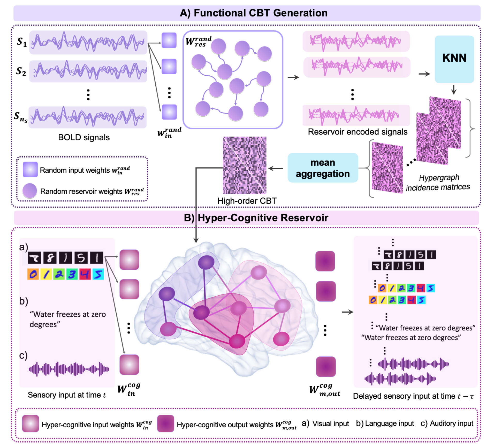

# HyperCOCO
HyperCOCO: Multi-sensory Hyper COgnitive COmputing for Learning Population-level Brain Connectivity
HyperCOCO is an extension of mCOCO that learns a high-order connectional brain template (CBT) from BOLD signals and endows it with cognitive memory traits using multi-sensory stimulation.

This work introduces a hyperconnectivity-aware framework to move beyond pairwise connectivity and better model complex population-level brain interactions.

Please contact mayssa.soussia@gmail.com for inquiries.

Introduction
HyperCOCO: Multi-sensory Hyper COgnitive COmputing for Learning Population Level Brain Connectivity

Mayssa Soussia, Mohamed Ali Mahjoub, Islem Rekik
BASIRA Lab, Imperial-X and Department of Computing, Imperial College London, UK
LATIS Lab, National Engineering School of Sousse, University of Sousse, Tunisia

Abstract (short):
HyperCOCO learns a high-order, cognitively enhanced CBT from population BOLD signals using reservoir computing. The framework has two stages:

Generate high-order individual functional connectomes and aggregate them into a population-level CBT.
Instantiate the CBT in a hyper-cognitive reservoir and evaluate memory capacity using visual, auditory, and linguistic streams.
Key Contributions
High-order CBT learning: captures richer multi-regional interactions than pairwise-only approaches.
Hyperconnectivity modeling: extends mCOCO with high-order functional representation.
Cognitive enhancement: evaluates short-term memory behavior using multi-sensory stimulation.
Reservoir computing backbone: interpretable, biologically inspired, and computationally efficient.
Dataset Description
The repository includes an ABIDE subset (preprocessed functional data), with:

73 ASD participants
77 TD controls
For full cohort access, visit ABIDE:
https://fcon_1000.projects.nitrc.org/indi/abide/

Project Structure
1) High-order CBT Generation
Script: cbt_generation.py
Goal: build high-order individual connectomes from BOLD signals, then aggregate into a population-level CBT.
2) Multi-sensory Memory Capacity Evaluation
Script: multi_sensory_memory_capacity.py
Goal: evaluate cognitive memory capacity of the learned CBT using multi-sensory inputs.
Sensory inputs

Visual: MNIST stream
Audio: music and speech/recitation streams
Language: Gutenberg-based text embeddings

Installation
Use Python 3.9+ (recommended), then install dependencies:

pip install -r requirements.txt
Run the Pipeline
1) Generate high-order CBT
python cbt_generation.py
2) Evaluate multi-sensory memory capacity
python multi_sensory_memory_capacity.py
Citation
If you use HyperCOCO, please cite:

@article{soussia2026hypercoco,
  title={HyperCOCO: Multi-sensory Hyper COgnitive COmputing for Learning Population Level Brain Connectivity},
  author={Soussia, Mayssa and Mahjoub, Mohamed Ali and Rekik, Islem},
  journal={Medical Image Analysis},
  year={2026},
}
If you also use the predecessor framework, please cite mCOCO (MICCAI 2025) as well.

Acknowledgments
HyperCOCO extends the mCOCO framework by introducing hyperconnectivity-aware high-order modeling for population-level CBT learning.
